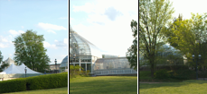

# Neural Spline Fields for Burst Image Fusion and Layer Separation
<a href="https://colab.research.google.com/github/princeton-computational-imaging/NeuLS/blob/main/tutorial.ipynb" style="text-decoration: none;">
  
</a>
<a href="https://github.com/Ilya-Muromets/Pani" style="text-decoration: none;">
  
</a>

This is the official code repository for the SIGGRAPH Asia 2024 work: [Neural Light Spheres for Implicit Image Stitching and View Synthesis](https://light.princeton.edu/publication/neuls/). If you use parts of this work, or otherwise take inspiration from it, please considering citing our paper:
```
@inproceedings{chugunov2024light,
author = {Chugunov, Ilya and Joshi, Amogh and Murthy, Kiran and Bleibel, Francois and Heide, Felix},
title = {Neural Light Spheres for {Implicit Image Stitching and View Synthesis}},
booktitle = {Proceedings of the ACM SIGGRAPH Asia 2024},
year = {2024},
publisher = {ACM},
doi = {10.1145/3680528.3687660},
url = {https://doi.org/10.1145/3680528.3687660}
}
```

## Requirements:
- Code was written in PyTorch 2.2.1 and Pytorch Lightning 2.0.1 on an Ubuntu 22.04 machine.
- Condensed package requirements are in `\requirements.txt`. Note that this contains the exact package versions at the time of publishing. Code will most likely work with newer versions of the libraries, but you will need to watch out for changes in class/function calls.
- The non-standard packages you may need are `pytorch_lightning`, `commentjson`, `rawpy`, `pygame`, and `tinycudann`. See [NVlabs/tiny-cuda-nn](https://github.com/NVlabs/tiny-cuda-nn) for installation instructions. Depending on your system you might just be able to do `pip install git+https://github.com/NVlabs/tiny-cuda-nn/#subdirectory=bindings/torch`, or might have to cmake and build it from source.

## Project Structure:
```cpp
NSF
  ├── checkpoints  
  │   └── // folder for network checkpoints
  ├── config
  │   └── // network and encoding configurations for different sizes of MLPs
  ├── data  
  │   └── // folder for image sequence data
  ├── lightning_logs  
  │   └── // folder for tensorboard logs
  ├── outputs  
  │   └── // folder for model outputs (e.g., final reconstructions) 
  ├── utils  
  │   └── utils.py  // model helper functions (e.g., RAW demosaicing, quaternion math)
  ├── LICENSE  // legal stuff
  ├── README.md  // <- recursion errors
  ├── render.py  // interactive render demo
  ├── requirements.txt  // frozen package requirements
  ├── train.py  // dataloader, network, visualization, and trainer code
  └── tutorial.ipynb // interactive tutorial for training the model
  ```
## Getting Started:
We highly recommend you start by going through `tutorial.ipynb`, either on your own machine or [with this Google Colab link](https://colab.research.google.com/github/princeton-computational-imaging/NeuLS/blob/main/tutorial.ipynb). 

TLDR: models can be trained with:

`python3 train.py --data_path {path_to_data} --name {checkpoint_name}`

For a full list of training arguments, we recommend looking through the argument parser section at the bottom of `\train.py`.

The final model checkpoint will be saved to `checkpoints/{checkpoint_name}/last.ckpt`

And you can launch an interactive demo for the scene via:

`python3 render.py --checkpoint {path_to_checkpoint_folder}`

<div style="text-align: center;">
    
</div>

Press `P`  to turn the view-dependent color model off/on, `O` to turn the ray offset model off/on, `+` and `-` to raise and lower the image brightness, click and drag to rotate the camera, hold shift and click and drag to translate the camera, scroll to zoom in/out, press `R` to reset the view, and `Escape` to quit.


## Data:
This models trains on data recorded by our Android RAW capture app [Pani](https://github.com/Ilya-Muromets/Pani), see that repo for details on collecting/processing your own captures.

You can download the full `30gb` dataset via [this link](https://soap.cs.princeton.edu/neuls/neuls_data.zip), or the individual scenes from the paper via following links:

| Image | Name | Num Frames | Camera Lens | ISO | Exposure Time (s) | Aperture | Focal Length | Height | Width |
|-------|------|------------|-------------|-----|-------------------|----------|--------------|--------|-------|
|  | <a href="https://soap.cs.princeton.edu/neuls/360Road.zip" target="_blank">360Road</a> | 77 | main | 21 | 1/1110 | 1.68 | 6.9 | 3072 | 4080 |
|  | <a href="https://soap.cs.princeton.edu/neuls/Beppu.zip" target="_blank">Beppu</a> | 40 | main | 21 | 1/630 | 1.68 | 6.9 | 3072 | 4080 |
|  | <a href="https://soap.cs.princeton.edu/neuls/BikeRacks.zip" target="_blank">BikeRacks</a> | 48 | main | 21 | 1/1960 | 1.68 | 6.9 | 3072 | 4080 |
|  | <a href="https://soap.cs.princeton.edu/neuls/BikeShelf.zip" target="_blank">BikeShelf</a> | 37 | main | 8065 | 1/100 | 1.68 | 6.9 | 3072 | 4080 |
|  | <a href="https://soap.cs.princeton.edu/neuls/BluePit.zip" target="_blank">BluePit</a> | 32 | main | 21 | 1/199 | 1.68 | 6.9 | 3072 | 4080 |
|  | <a href="https://soap.cs.princeton.edu/neuls/BluePlane.zip" target="_blank">BluePlane</a> | 59 | main | 1005 | 1/120 | 1.68 | 6.9 | 3072 | 4080 |
|  | <a href="https://soap.cs.princeton.edu/neuls/Bridge.zip" target="_blank">Bridge</a> | 49 | main | 21 | 1/1384 | 1.68 | 6.9 | 3072 | 4080 |
|  | <a href="https://soap.cs.princeton.edu/neuls/CityCars.zip" target="_blank">CityCars</a> | 46 | main | 21 | 1/1744 | 1.68 | 6.9 | 3072 | 4080 |
|  | <a href="https://soap.cs.princeton.edu/neuls/Construction.zip" target="_blank">Construction</a> | 53 | main | 21 | 1/1653 | 1.68 | 6.9 | 3072 | 4080 |
|  | <a href="https://soap.cs.princeton.edu/neuls/DarkDistillery.zip" target="_blank">DarkDistillery</a> | 57 | main | 10667 | 1/100 | 1.68 | 6.9 | 3072 | 4080 |
|  | <a href="https://soap.cs.princeton.edu/neuls/DarkPeace.zip" target="_blank">DarkPeace</a> | 51 | main | 10667 | 1/100 | 1.68 | 6.9 | 3072 | 4080 |
|  | <a href="https://soap.cs.princeton.edu/neuls/DarkShrine.zip" target="_blank">DarkShrine</a> | 34 | main | 5065 | 1/80 | 1.68 | 6.9 | 3072 | 4080 |
|  | <a href="https://soap.cs.princeton.edu/neuls/DarkTruck.zip" target="_blank">DarkTruck</a> | 43 | main | 10667 | 1/60 | 1.68 | 6.9 | 3072 | 4080 |
|  | <a href="https://soap.cs.princeton.edu/neuls/Eiffel.zip" target="_blank">Eiffel</a> | 73 | main | 21 | 1/1183 | 1.68 | 6.9 | 3072 | 4080 |
|  | <a href="https://soap.cs.princeton.edu/neuls/Escalatosaur.zip" target="_blank">Escalatosaur</a> | 49 | main | 589 | 1/100 | 1.68 | 6.9 | 3072 | 4080 |
|  | <a href="https://soap.cs.princeton.edu/neuls/Fireworks.zip" target="_blank">Fireworks</a> | 78 | main | 5000 | 1/100 | 1.68 | 6.9 | 3072 | 4080 |
|  | <a href="https://soap.cs.princeton.edu/neuls/Fukuoka.zip" target="_blank">Fukuoka</a> | 40 | main | 21 | 1/1312 | 1.68 | 6.9 | 3072 | 4080 |
|  | <a href="https://soap.cs.princeton.edu/neuls/LanternDeer.zip" target="_blank">LanternDeer</a> | 34 | main | 42 | 1/103 | 1.68 | 6.9 | 3072 | 4080 |
|  | <a href="https://soap.cs.princeton.edu/neuls/MountainTop.zip" target="_blank">MountainTop</a> | 59 | main | 21 | 1/2405 | 1.68 | 6.9 | 3072 | 4080 |
|  | <a href="https://soap.cs.princeton.edu/neuls/Ocean.zip" target="_blank">Ocean</a> | 44 | main | 110 | 1/127 | 1.68 | 6.9 | 3072 | 4080 |
|  | <a href="https://soap.cs.princeton.edu/neuls/ParisCity.zip" target="_blank">ParisCity</a> | 55 | main | 21 | 1/1265 | 1.68 | 6.9 | 3072 | 4080 |
|  | <a href="https://soap.cs.princeton.edu/neuls/PlaneHall.zip" target="_blank">PlaneHall</a> | 77 | main | 1005 | 1/120 | 1.68 | 6.9 | 3072 | 4080 |
|  | <a href="https://soap.cs.princeton.edu/neuls/PondHouse.zip" target="_blank">PondHouse</a> | 51 | main | 21 | 1/684 | 1.68 | 6.9 | 3072 | 4080 |
|  | <a href="https://soap.cs.princeton.edu/neuls/RainyPath.zip" target="_blank">RainyPath</a> | 38 | main | 600 | 1/100 | 1.68 | 6.9 | 3072 | 4080 |
|  | <a href="https://soap.cs.princeton.edu/neuls/RedShrine.zip" target="_blank">RedShrine</a> | 40 | main | 21 | 1/499 | 1.68 | 6.9 | 3072 | 4080 |
|  | <a href="https://soap.cs.princeton.edu/neuls/RockStream.zip" target="_blank">RockStream</a> | 31 | main | 21 | 1/1110 | 1.68 | 6.9 | 3072 | 4080 |
|  | <a href="https://soap.cs.princeton.edu/neuls/Seafood.zip" target="_blank">Seafood</a> | 44 | main | 21 | 1/193 | 1.68 | 6.9 | 3072 | 4080 |
|  | <a href="https://soap.cs.princeton.edu/neuls/ShinyPlane.zip" target="_blank">ShinyPlane</a> | 50 | main | 21 | 1/210 | 1.68 | 6.9 | 3072 | 4080 |
|  | <a href="https://soap.cs.princeton.edu/neuls/ShinySticks.zip" target="_blank">ShinySticks</a> | 37 | main | 21 | 1/1417 | 1.68 | 6.9 | 3072 | 4080 |
|  | <a href="https://soap.cs.princeton.edu/neuls/SnowTree.zip" target="_blank">SnowTree</a> | 42 | main | 21 | 1/320 | 1.68 | 6.9 | 3072 | 4080 |
|  | <a href="https://soap.cs.princeton.edu/neuls/Stalls.zip" target="_blank">Stalls</a> | 52 | main | 49 | 1/79 | 1.68 | 6.9 | 3072 | 4080 |
|  | <a href="https://soap.cs.princeton.edu/neuls/StatueLeft.zip" target="_blank">StatueLeft</a> | 22 | main | 805 | 1/60 | 1.68 | 6.9 | 3072 | 4080 |
|  | <a href="https://soap.cs.princeton.edu/neuls/StatueRight.zip" target="_blank">StatueRight</a> | 26 | main | 802 | 1/60 | 1.68 | 6.9 | 3072 | 4080 |
|  | <a href="https://soap.cs.princeton.edu/neuls/Tenjin.zip" target="_blank">Tenjin</a> | 36 | main | 602 | 1/100 | 1.68 | 6.9 | 3072 | 4080 |
|  | <a href="https://soap.cs.princeton.edu/neuls/Tigers.zip" target="_blank">Tigers</a> | 42 | main | 507 | 1/200 | 1.68 | 6.9 | 3072 | 4080 |
|  | <a href="https://soap.cs.princeton.edu/neuls/Toronto.zip" target="_blank">Toronto</a> | 31 | main | 21 | 1/1250 | 1.68 | 6.9 | 3072 | 4080 |
|  | <a href="https://soap.cs.princeton.edu/neuls/Vending.zip" target="_blank">Vending</a> | 42 | main | 21 | 1/352 | 1.68 | 6.9 | 3072 | 4080 |
|  | <a href="https://soap.cs.princeton.edu/neuls/WoodOffice.zip" target="_blank">WoodOffice</a> | 83 | main | 206 | 1/120 | 1.68 | 6.9 | 3072 | 4080 |
|  | <a href="https://soap.cs.princeton.edu/neuls/GlassGarden.zip" target="_blank">GlassGarden</a> | 59 | telephoto | 24 | 1/231 | 2.8 | 18.0 | 3024 | 4032 |
|  | <a href="https://soap.cs.princeton.edu/neuls/NaraCity.zip" target="_blank">NaraCity</a> | 54 | telephoto | 17 | 1/327 | 2.8 | 18.0 | 3024 | 4032 |
|  | <a href="https://soap.cs.princeton.edu/neuls/360Beach.zip" target="_blank">360Beach</a> | 56 | ultrawide | 42 | 1/3175 | 1.95 | 2.23 | 3000 | 4000 |
|  | <a href="https://soap.cs.princeton.edu/neuls/360Garden.zip" target="_blank">360Garden</a> | 77 | ultrawide | 41 | 1/1104 | 1.95 | 2.23 | 3000 | 4000 |
|  | <a href="https://soap.cs.princeton.edu/neuls/360Siegen.zip" target="_blank">360Siegen</a> | 67 | ultrawide | 41 | 1/1029 | 1.95 | 2.23 | 3000 | 4000 |
|  | <a href="https://soap.cs.princeton.edu/neuls/CatBar.zip" target="_blank">CatBar</a> | 37 | ultrawide | 88 | 1/110 | 1.95 | 2.23 | 3000 | 4000 |
|  | <a href="https://soap.cs.princeton.edu/neuls/Convocation.zip" target="_blank">Convocation</a> | 43 | ultrawide | 41 | 1/2309 | 1.95 | 2.23 | 3000 | 4000 |
|  | <a href="https://soap.cs.princeton.edu/neuls/MellonDoor.zip" target="_blank">MellonDoor</a> | 40 | ultrawide | 41 | 1/564 | 1.95 | 2.23 | 3000 | 4000 |
|  | <a href="https://soap.cs.princeton.edu/neuls/RedPit.zip" target="_blank">RedPit</a> | 53 | ultrawide | 41 | 1/418 | 1.95 | 2.23 | 3000 | 4000 |
|  | <a href="https://soap.cs.princeton.edu/neuls/River.zip" target="_blank">River</a> | 65 | ultrawide | 48 | 1/78 | 1.95 | 2.23 | 3000 | 4000 |
|  | <a href="https://soap.cs.princeton.edu/neuls/UniversityCollege.zip" target="_blank">UniversityCollege</a> | 55 | ultrawide | 42 | 1/2177 | 1.95 | 2.23 | 3000 | 4000 |
|  | <a href="https://soap.cs.princeton.edu/neuls/Waterfall.zip" target="_blank">Waterfall</a> | 74 | ultrawide | 41 | 1/1621 | 1.95 | 2.23 | 3000 | 4000 |

Glhf,  
Ilya
